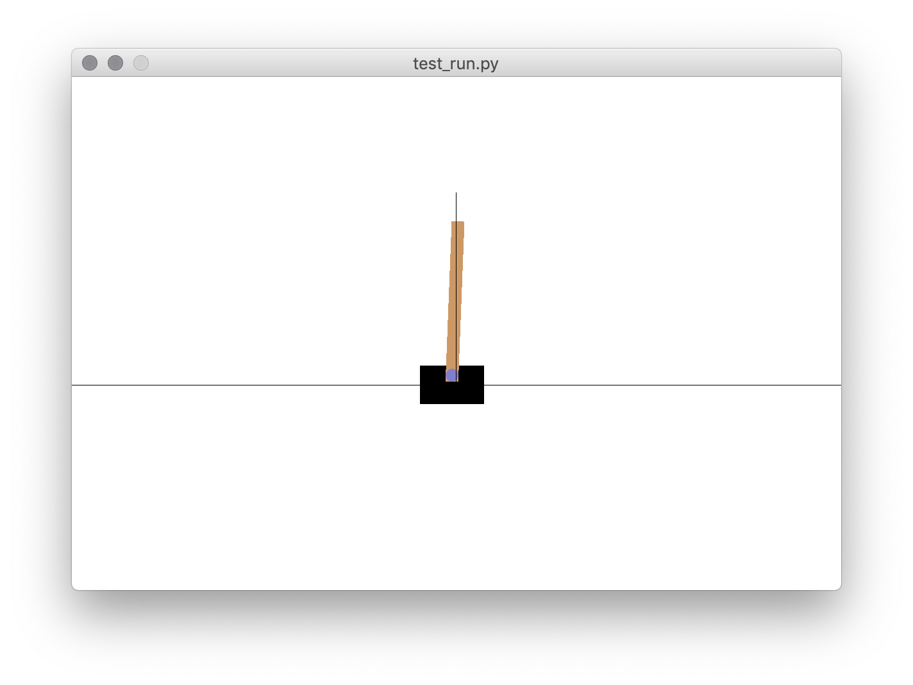

# gym-CartPole-bt-v0
This is a modified version of the [cart-pole OpenAI Gym environment](https://gym.openai.com/envs/CartPole-v1/) for testing
different controllers and reinforcement learning algorithms.



This version of the classic cart-pole or [cart-and-inverted-pendulum](https://en.wikipedia.org/wiki/Inverted_pendulum#Inverted_pendulum_on_a_cart)
control problem offers more variations on the basic OpenAI
Gym version ('CartPole-v1').

It is based on a MATLAB implementation by [Steven L. Brunton](https://www.me.washington.edu/facultyfinder/steve-brunton)
as part of his excellent [Control Bootcamp](https://youtu.be/qjhAAQexzLg) series of videos on
YouTube.

Features of this version include:
- More challenging control objectives such as stabilizing the 
  cart x-position as well as the pendulum angle and moving the
  cart-pendulum horizontally from one point to another
- Continuously varying control actions
- Random initial states
- Random disturbance to the state
- Not all state variables measured
- Non-stationary disturbance to the state [***Not Implemented Yet***]
- Measurement noise [***Not Implemented Yet***]
- With dead time [***Not Implemented Yet***]

The goal of building this environment was to test different control 
engineering and reinforcement learning methods on a problem that 
is more challenging than the simple cart-pole environment provided 
by OpenAI but still simple enough to understand and help us learn
about the relative strengths and weaknesses of control/RL 
approaches.


## Installation

To install this environment, first clone or download this repository, then
go to the `gym-CartPole-bt-v0` folder on your computer and run the 
following command in your terminal:

```
pip install -e .
```

This will install the gym environment.  To use the new gym environment in
Python do the following:

```Python
import gym
import gym_CartPole_BT

env = gym.make('CartPole-BT-v0')
```

## Environments

There are currently 6 environments that you can use.  Select the environment
using the id in the table below in the `gym.make` function.

| #  | Id                       | Description                                                                                  |
| -- | ------------------------ | -------------------------------------------------------------------------------------------- |
|  1 | `'CartPole-BT-v0'`       | Basic cart-pendulum system (in vertical up position, no random disturbances)                 |
|  2 | `'CartPole-BT-dL-v0'`    | ...with low random disturbance                                                               |
|  3 | `'CartPole-BT-dH-v0'`    | ...with high random disturbance                                                              |
|  4 | `'CartPole-BT-vL-v0'`    | ...with low variance in initial state                                                        |
|  5 | `'CartPole-BT-vH-v0'`    | ...with high variance in initial state                                                       |
|  6 | `'CartPole-BT-dL-vL-v0'` | ...with low random disturbance and low variance in initial state                             |
|  7 | `'CartPole-BT-dH-vH-v0'` | ...with high random disturbance and high variance in initial state                           |
|  8 | `'CartPole-BT-m2-v0'`    | ...with initial state distance -2 from goal                                                  |
|  9 | `'CartPole-BT-m2-dL-v0'` | ...with initial state distance -2 from goal and small random disturbance                     |
| 10 | `'CartPole-BT-m2-dH-v0'` | ...with initial state distance -2 from goal and high random disturbance                      |
| 11 | `'CartPole-BT-p2-v0'`    | ...with 2 of 4 states measured (cart x-position and pole angle)                              |
| 12 | `'CartPole-BT-p2-dL-v0'` | ...with 2 of 4 states measured and small random disturbance                                  |
| 13 | `'CartPole-BT-p2-dH-v0'` | ...with 2 of 4 states measured and high random disturbance                                   |
| 14 | `'CartPole-BT-p2-vL-v0'` | ...with 2 of 4 states measured and low variance in initial state                             |
| 15 | `'CartPole-BT-p2-vH-v0'` | ...with 2 of 4 states measured and high variance in initial state                            |

## Basic usage (without graphics)

```Python
import gym
import gym_CartPole_BT
import numpy as np

# Create and initialize environment
env = gym.make('CartPole-BT-v0')
env.reset()

# Control vector (shape (1, ) in this case)
u = np.zeros(1)

# We will keep track of the cumulative rewards
cum_reward = 0.0

print(f"{'i':>3s}  {'u':>5s} {'reward':>6s} {'cum_reward':>10s}")
print("-"*28)

# Run one episode
done = False
while not done:

    # Retrieve the system state
    x, x_dot, theta, theta_dot = env.state

    # Decide control action (force on cart)
    u[0] = 0.0  # REPLACE THIS WITH YOUR CONTROLLER

    # Run simulation one time-step
    observation, reward, done, info = env.step(u)

    # Process the reward
    cum_reward += reward

    # Print updates
    print(f"{env.time_step:3d}: {u[0]:5.1f} {reward:6.2f} {cum_reward:10.1f}")
```

For demos with graphics animation run the following script with the `-r` option selected and your choice of environment:

- `test_run.py -e CartPole-BT-dL-v0 -r`

To run an environment with an optimal linear controller, run this script:

- `test_run_lqr.py -e CartPole-BT-m2-dL-v0 -r`

