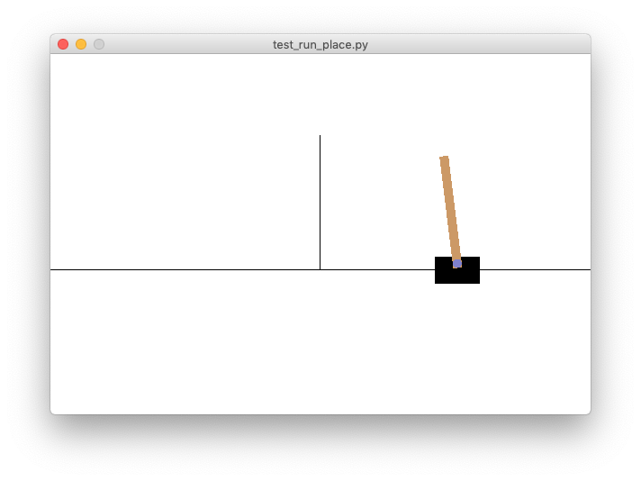
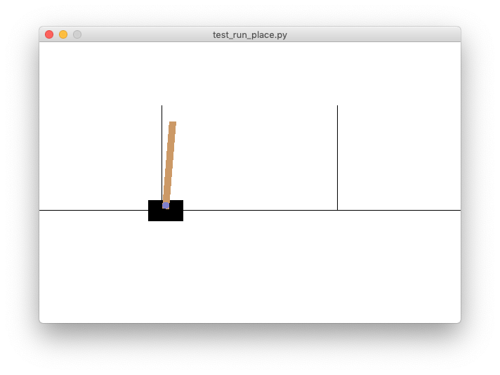

# gym-CartPole-bt-v0

This is a modified version of the [cart-pole OpenAI Gym environment](https://gym.openai.com/envs/CartPole-v1/) for testing
different controllers and reinforcement learning algorithms.



This version of the classic cart-pole or [cart-and-inverted-pendulum](https://en.wikipedia.org/wiki/Inverted_pendulum#Inverted_pendulum_on_a_cart)
control problem offers more variations on the basic OpenAI
Gym version ('CartPole-v1').

It is based on a MATLAB implementation by [Steven L. Brunton](https://www.me.washington.edu/facultyfinder/steve-brunton)
as part of his excellent [Control Bootcamp](https://youtu.be/qjhAAQexzLg) series of videos on
YouTube.

Features of this set of environments include:
- More challenging control objectives such as stabilizing the 
  cart x-position as well as the pendulum angle and moving the
  cart-pendulum horizontally from one point to another
- Continuously varying control actions
- Random initial states
- Random state disturbance 
- Partially-observable states
- Non-stationary disturbance to the state [***Not Implemented Yet***]
- Measurement noise [***Not Implemented Yet***]
- With dead time [***Not Implemented Yet***]

The goal of building this set of environments was to test different control 
  and reinforcement learning (RL) methods on problems that are more 
  challenging than the simple cart-pole environment provided by OpenAI 
  and more like real-world control problems but still simple enough to 
  understand and to demonstrate the relative strengths and weaknesses of
  control and RL approaches.


## Installation

OpenAI have officially stopped supporting old environments like this one
and development has moved to [Gymnasium](https://github.com/Farama-Foundation/Gymnasium), which is a 
replacement for Gym. However, this environment still runs fine (I 
tested it on 2024-01-28), ***as long as you install the old versions of gym (0.21.0) 
and pyglet (1.5.27)***, as specified in the [requirements.txt](requirements.txt) file.

It also requires pip version 21.0 and setuptools version 65.5.0 as explained [here](https://stackoverflow.com/a/77205046/1609514).

Since these are quite old versions, you should probably create a virtual environment
before starting the installation.

Then clone or download this repository, go to the `gym-CartPole-bt-v0`
directory in the terminal on your computer and run the following command:
```
pip install -e .
```
This should install all the correct versions and the gym environment.  

If you get the following error:
```lang-none
ImportError: cannot import name 'rendering' from 'gym.envs.classic_control'
```
then it means you didn't install the old version of gym. See [this bug report](https://github.com/openai/gym/issues/2779)
on their github site.

Finally, to check everything is working you can run this test script:
```
python test_run.py -r
```
The option `-r` will make it render the cart-pole animation, or use `-s` instead to print only text output.

## Basic Usage

To use the new gym environment in Python do the following:

```Python
import gym
import gym_CartPole_BT

env = gym.make('CartPole-BT-v0')
```

## Environments

There are currently 15 variations of the basic environment that you can use.
  Select the id for a environment from the tables below and provide it as an 
  argument to the `gym.make` function.

### Basic cart-pendulum system

This is the basic environment where the goal, starting in or near the
  vertical up position, is to maintain the x-position and the pole angle as
  close as possible to (0, 0).

| #  | Id                       | Description                                                                                  |
| -- | ------------------------ | -------------------------------------------------------------------------------------------- |
|  1 | `'CartPole-BT-v0'`       | Basic cart-pendulum system starting in vertical up position                                  |
|  2 | `'CartPole-BT-dL-v0'`    | ...with low random disturbance                                                               |
|  3 | `'CartPole-BT-dH-v0'`    | ...with high random disturbance                                                              |
|  4 | `'CartPole-BT-vL-v0'`    | ...with low variance in initial state                                                        |
|  5 | `'CartPole-BT-vH-v0'`    | ...with high variance in initial state                                                       |
|  6 | `'CartPole-BT-dL-vL-v0'` | ...with low random disturbance and low variance in initial state                             |
|  7 | `'CartPole-BT-dH-vH-v0'` | ...with high random disturbance and high variance in initial state                           |


### Variant 1 - partially observable state

In the following variants of the above basic environment, only the cart 
x-position and the pole angle measurement are available each timestep.

| #  | Id                       | Description                                                                                  |
| -- | ------------------------ | -------------------------------------------------------------------------------------------- |
|  1 | `'CartPole-BT-p2-v0'`    | Basic cart-pendulum system with 2 of 4 states measured (cart x-position and pole angle)      |
|  2 | `'CartPole-BT-p2-dL-v0'` | ...and low random disturbance                                                                |
|  3 | `'CartPole-BT-p2-dH-v0'` | ...and high random disturbance                                                               |
|  4 | `'CartPole-BT-p2-vL-v0'` | ...and low variance in initial state                                                         |
|  5 | `'CartPole-BT-p2-vH-v0'` | ...and high variance in initial state                                                        |


### Variant 2 - Initial state to the left of the goal state

In the following variants of the above basic environment, the pendulum
  starts at a distance 2 to the left of the goal state in the x-direction.
  The goal is to move the pendulum to the right as quickly as possible and
  stabilize it at the goal state.



| #  | Id                       | Description                                                                                  |
| -- | ------------------------ | -------------------------------------------------------------------------------------------- |
|  1 | `'CartPole-BT-x2-v0'`    | Basic cart-pendulum system with initial state distance -2 from goal state                    |
|  2 | `'CartPole-BT-x2-dL-v0'` | ...and low random disturbance                                                                |
|  3 | `'CartPole-BT-x2-dH-v0'` | ...and high random disturbance                                                               |


## Basic simulations (without graphics)

```Python
import gym
import gym_CartPole_BT
import numpy as np

# Create and initialize environment
env = gym.make('CartPole-BT-dL-v0')
env.reset()

# Control vector (shape (1, ) in this case)
u = np.zeros(1)

# We will keep track of the cumulative rewards
cum_reward = 0.0

print(f"{'i':>3s}  {'u':>5s} {'reward':>6s} {'cum_reward':>10s}")
print("-"*28)

# Run one episode
done = False
while not done:

    # Retrieve the system state
    x, x_dot, theta, theta_dot = env.state

    # Decide control action (force on cart)
    u[0] = 0.0  # REPLACE THIS WITH YOUR CONTROLLER

    # Run simulation one time-step
    observation, reward, done, info = env.step(u)

    # Process the reward
    cum_reward += reward

    # Print updates
    print(f"{env.time_step:3d}: {u[0]:5.1f} {reward:6.2f} {cum_reward:10.1f}")
```

## Demonstrations

### Simulations with graphics animation

To see a simulation of an environment with graphics animation, run the following scripts with the `-r` option selected and your choice of environment:

```
python test_run.py -e CartPole-BT-dL-v0 -r
```

### Demonstrations of controllers

To see a demonstration of how to control these systems with a linear,
  full-state feedback controller (LQR), run the following script,
  specifying the desired environment as an argument:

```
python test_run_lqr.py -s -r -e 'CartPole-BT-dL-v0'
```

The `-s` argument here prints the action, reward and cumulative reward
  each timestep to the console.

For systems with partially-observed states (environments with the `-p2`
  setting), a state estimator can be used to estimate the unmeasured
  states. To see a demonstration of a linear, full-state feedback
  controller combined with a linear Kalman filter, run the following 
  script:

```
python test_run_lqg.py -s -r -e 'CartPole-BT-p2-dL-v0'
```

Here, the true states and state estimates are printed to the console.
